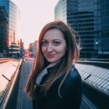

# Hi 👋 I'm Agnieszka

## About Me 😃

Greetings from Belgium! I'm Agnieszka, and I come from Poland with a background
in Land and Real Estate Management. After completing my master's degree and
gaining 8 years of experience in Logistics, I've decided to embark on an
exciting new journey in Web Development.

Living in Belgium has enriched my experiences, and now I'm channeling my passion
for building websites into becoming an aspiring programmer. The prospect of
creating digital landscapes and contributing to the ever-evolving world of
technology excites me, and I'm super motivated to dive into this transformative
career change.

I'm currently enhancing my skills and knowledge in:

  

---

## My hobbies 🌴

- travel 🌴
- cross-fit 💪
- ice-swimming ❄️🏊‍♀️
- food 🍔
- singing under the shower 🚿🎤,

## Languages 🎏

- English
- French
- Polish
